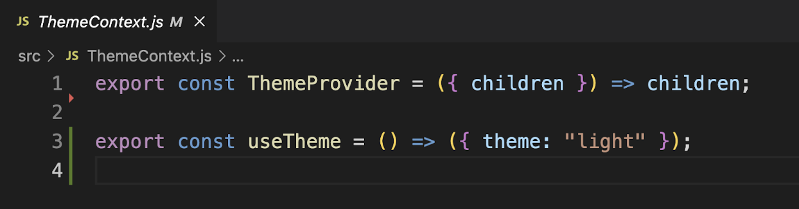
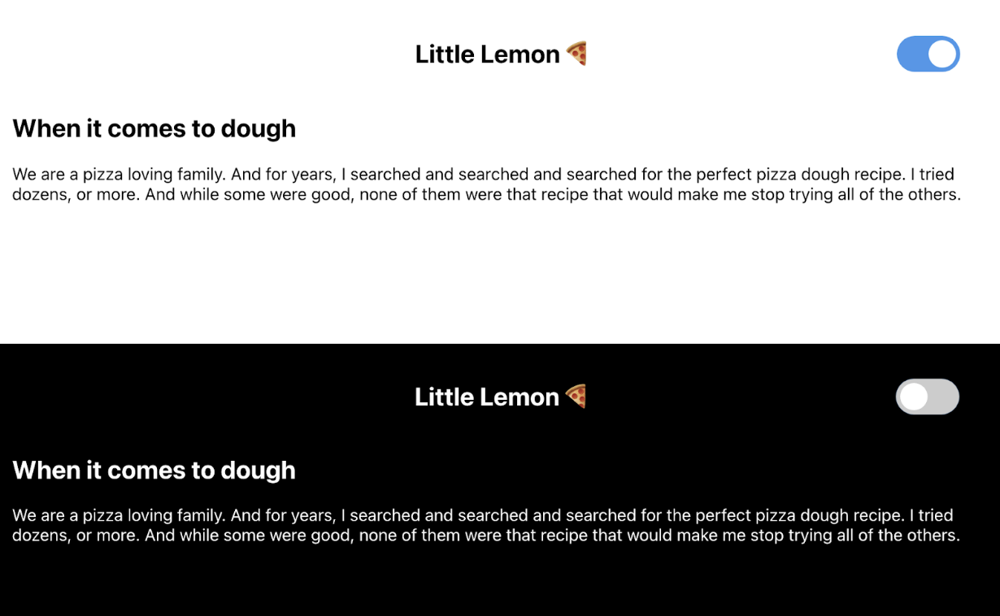

# Light-Dark Theme Switcher with React Context

This project demonstrates how to implement a light-dark theme switcher using React Context to manage global state without passing props through each component. The application includes a `Switch` component to toggle between light and dark themes, and the goal is to implement the missing functionality in `ThemeContext.js`.

## Overview

The starter code includes all necessary UI elements and a `Switch` component for toggling the theme. The `ThemeContext.js` file exports a `ThemeProvider` component and a `useTheme` hook, which initially return dummy values.

You need to implement the `ThemeProvider` component and the `useTheme` hook in `ThemeContext.js` to enable theme switching functionality. The `ThemeProvider` should provide a context object with a `theme` property (a string, either "light" or "dark") and a `toggleTheme` function to switch between themes. The `useTheme` hook should return this context object.

## Prerequisites

Before starting, ensure you are familiar with the Coursera Code Lab for the **Advanced React course**. Running `npm start` will launch the app, displaying a simple view with a header, page, and a switch widget in the top right corner to toggle the theme.

## Steps to Implement

### Step 1: Set Up ThemeContext
- Open the `ThemeContext.js` file.
- Create a `ThemeContext` object using `React.createContext()`.
- Implement the `ThemeProvider` component to:
  - Accept a `children` prop.
  - Return a `ThemeContext.Provider` component with a `value` prop containing an object with:
    - A `theme` string ("light" or "dark").
    - A `toggleTheme` function to toggle between "light" and "dark" themes.

### Step 2: Implement useTheme Hook
- In `ThemeContext.js`, implement the `useTheme` hook to return the `theme` and `toggleTheme` values from `ThemeContext`.

### Step 3: Update Switch Component
- Open the `Switch/index.js` file.
- Add an `onChange` prop to the `<input>` element.
- Pass a callback function as the event handler to trigger the `toggleTheme` function. (The event argument is not needed in this case.)

### Step 4: Test the Application
- Verify that the app works as expected:
  - Toggle the theme between "light" and "dark" using the switch.
  - Confirm that the page's background color and text color change accordingly.

